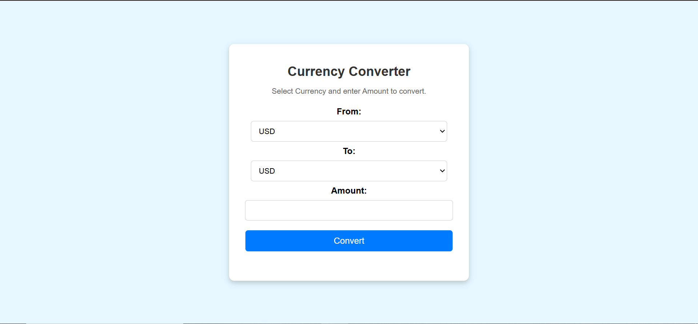

# 💰 Currency Converter using JavaScript  

A simple and interactive **Currency Converter** built with JavaScript, HTML, and CSS. This project allows users to select currencies, input an amount, and get real-time converted values.  

## Features  
Select currencies dynamically  
Convert entered amounts in real-time  
Responsive and user-friendly UI  
Fetches live exchange rates using an API  

## 🛠 Tech Stack  
- **HTML**: Structure of the webpage  
- **CSS**: Styling and layout design  
- **JavaScript**: Logic for currency conversion & API handling  

## 📸 Project Demo  
  

🎥 Check out the live demo: **[https://github.com/Pratik1Bhuwad/currency-converter-js/blob/22d5c6148d1ef7d2dc8fd381a3ad0a88aa58fcce/js_Project1.mp4]**  

## ⚙ How to Use  
1. Clone this repository:  
   ```bash
   git clone https://github.com/Pratik1Bhuwad/currency-converter-js.git
